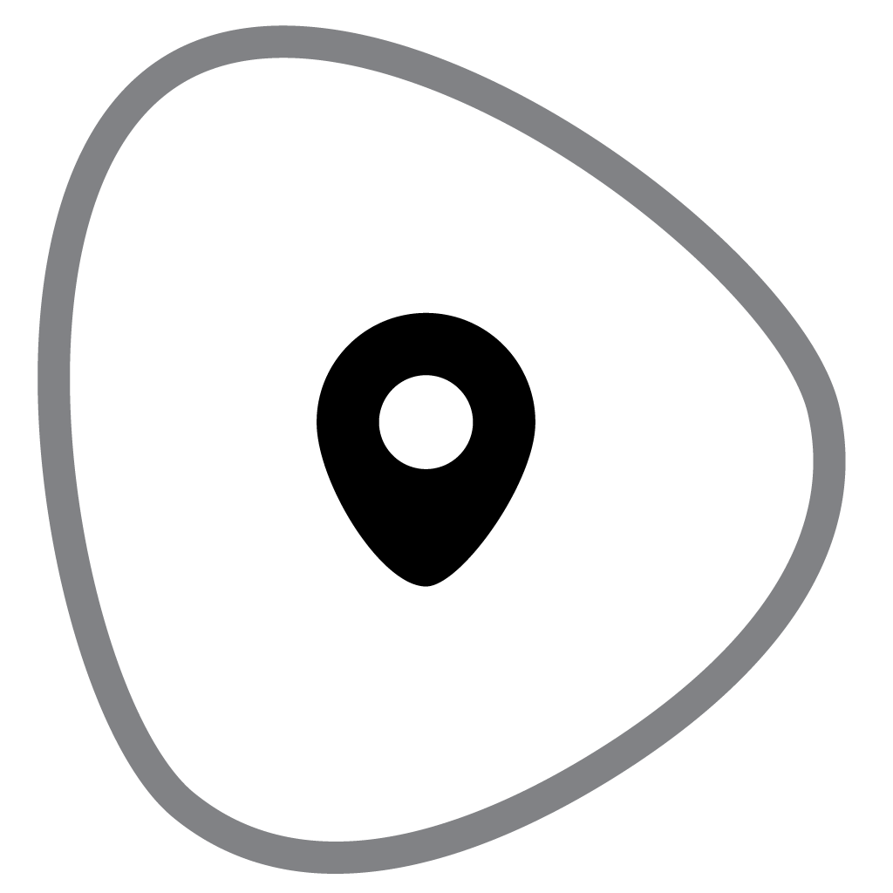

# A decentralized application that allows neighbors to create local organizations on the block-chain. 

# 

# What is ctylab.com
Ctylab is a community driven project developed step-by-step with groups of dedicated citizens, civil servants and entrepreneurs, who search for new ways to create value in a local context. Think of the sharing economy, crowd-funding, energy microgrids, participative democracy, local IoT data, municipal bonds and more. 

The platform helps citizengroups stay flexible, informal, trustworthy and spontaneous. It takes away the burdens of organization, financial payoffs, formal agreements, datasharing (and ownership), digital communication and marketing of ideas and events. Our goal is to let citizens share a common ground online, so that ideas, projects, funding and events reach the right people faster and more efficient.  

Its is born in Amsterdam, The Netherlands. It is 1 year old and for now only speaks Dutch (but is a fast learner).  

# Features
*   Private and public project environments with domainname capabilities.
*   Easy direct communication via Whatsapp or E-mail.
*   Location based lab environment. 
*   Easy to use; designed and developed for non-digital native users (no menu links or hidden resources).
*   Crowd-source tools that really do what they supposed too, and nothing more. 
*   Easy to use catalogue of tools.
*   Social network with social control.
*   Easy tenders to quickly fund actions, events, projects.
*   Contracting possible on a project, tool or item basis. 
*   Precise control of contract rules and execution of smart contracts on the block-chain.
*   Full encryption of personal details, local data is shared locally. 
*   100% privacy control, clear rules for transparency demands

# License
Apache 2.0 © AtelierVA
